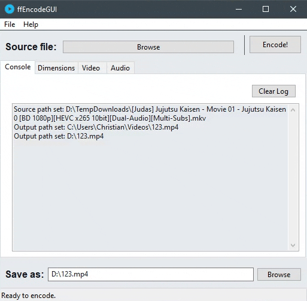

# ffEncodeGUI
Simple wxWidgets GUI for FFmpeg, written in C++ using wxWidgets Cross-Platform GUI Library, inspired by Handbrake.

   

## Features
- Change video dimensions.
- Crop video.
- H.264 / H.265 / VP8 / VP9 codec support.
- Change framerate.
- Optimize video: encoder preset, encoder tuning, encoder profile.
- Change the value of CRF (Constant Rate Factor).
- AAC / MP3 / Vorbis / Opus / FLAC codec support.
- Bitrate or quality audio setting.
- Available options depend on the container of the selected input file.

## Usage
This tool requires the FFmpeg binary file to exist in the `.\resources\ffmpeg.exe` path.
1. Select input media file by clicking on the *Browse* button.
2. Change the encoding settings as needed.
3. Click on the *Encode* button to start the encoding process.

## To-do
- Progress bar.
- Linux support.
- AV1 codec support.

## Third Party
[FFmpeg](https://ffmpeg.org/)

[wxWidgets](https://www.wxwidgets.org/)

## License
[MIT](https://choosealicense.com/licenses/mit/)
